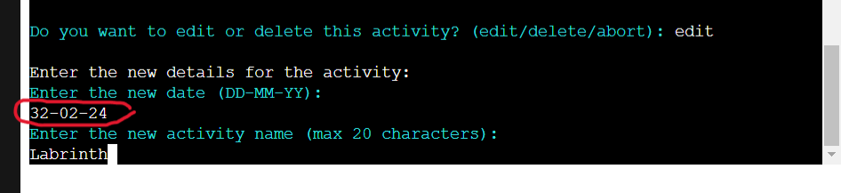
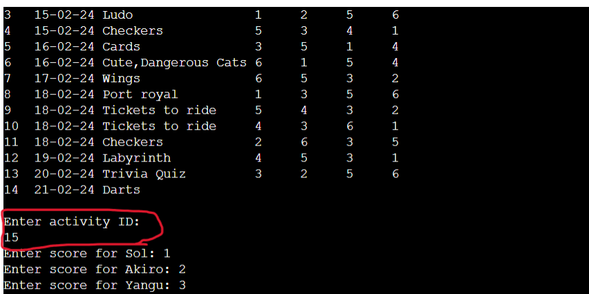
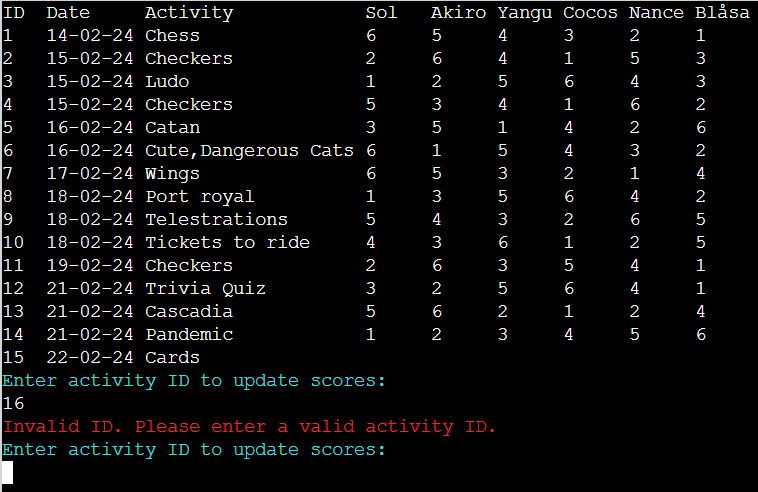
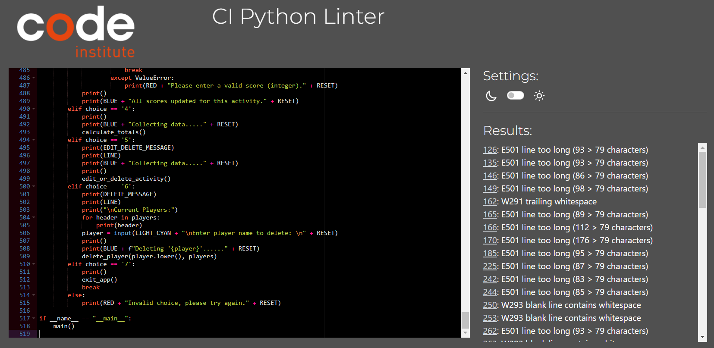
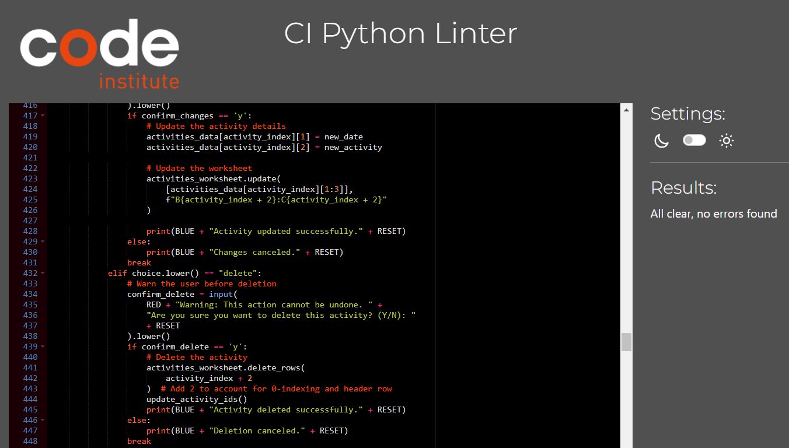

<h1 align = "center">Family Cozy Fridays App- Python Project </h1>

<b>[View live program here](https://family-cozy-fridays-bbda74529780.herokuapp.com/) </b>  

The Family Cozy Fridays App was created as Portfolio Project #3 (Python Essentials) for Diploma in Full Stack Software Development at [Code Institute](https://www.codeinstitute.net). It is designed to manage and track activities and scores for family games using Google Sheets API to store data. The app allows users to add and manage activities and players as well as update scores for each player in an activity. Also to view a leaderboard that ranks players by their total scores. The main goal is to provide a convenient way for families to track their activities and scores, enhancing their gaming experiences during "Family Cozy Fridays."

# Table of Content

*   [Project](#project)
    *   [Strategy/Scope](#strategyscope)
    *   [Site owner goals](#site-owner-goals)
    *   [External user's goal](#external-users-goal)
*   [User Experience (UX/UI)](#user-experience-ux)
*   [Logic and features](#logic-and-features)
    *   [Python logic](#python-logic)
    *   [Database structure](#database-structure)
    *   [Features](#features)
        *   [Main menu](#main-menu)
        *   [Add activity](#add-activity)
        *   [Add Player](#add-player)
        *   [Update Scores](#update-scores)
        *   [Leaderboard](#leaderboard)
        *   [Edit Delete Activity](#edit-delete-activity)
        *   [Delete Player](#delete-player)
        *   [Exit](#exit)
*   [Technology](#technology)
    *   [Software used](#software-used)
    *   [Python libraries/modules](#python-librariesmodules)
*   [Testing](#testing)
    *   [Validation](#validation)
*   [Deployment](#deployment)
    *   [Git and GitHub](#git-and-github)
    *   [Deployment to Heroku](#deployment-to-heroku)
*   [Possible future development](#possible-future-development)
*   [Resources, Credits and Acknowledgements](#resources-credits-and-acknowledgements)
    

# Project
## Strategy/Scope

The "Family Cozy Fridays" app aims to enhance family bonding and enjoyment during game nights by providing a convenient way to manage and track activities and scores. Family bonding on Friday nights is important as it provides a dedicated time for families to come together, unwind from the week's stresses, and create lasting memories through shared activities. These moments strengthen family relationships, foster communication, and promote a sense of unity and belonging within the family unit.

The app leverages Google Sheets API for data storage and management, ensuring accessibility and ease of use for all family members. The key features of the app include:

- Activity Management: Users can add new activities with dates and descriptions, ensuring a record of all family game nights.
- Player Management: The app allows users to add and manage player names, with a limit of 6 players per game, ensuring fair play and accurate score tracking.
- Score Tracking: Users can update scores for each player in an activity, with the app automatically calculating total scores and ranking players on a leaderboard.
- Editing and Deleting Activities:  Users can edit or delete activities, providing flexibility in managing game night data.
- User-Friendly Interface: The app features a clear and colorful terminal interface, with options displayed in a menu format for easy navigation.

The initial scope of the app includes the following features:

- Users can add new activities with dates
- Users can add and manage player names, with a limit of 6 players per game.
- Users can update scores for each player in an activity.
- The app calculates total scores and ranks players on a leaderboard.
- Users can edit or delete activities.
- Users can delete players from the list.
- Users can exit the application with a confirmation prompt.

## Site owner goals

As a developer I would like to:
- Enhanced Family Bonding: To provide a platform that enhances family bonding by simplifying the organization of game nights and encouraging regular family activities.
- User Engagement: To increase user engagement by offering a user-friendly interface and interactive features that motivate families to participate and track their activities regularly.
- Data Collection: To collect valuable data on user activities and preferences, which can be used to improve the app and tailor future updates to better suit user needs.
- Monetization: For the future, to monetize the app through advertisements, premium features, or partnerships with family-oriented gaming brands.

##  External user's goal

As a user I would like to:
- Convenience: To have a convenient way to organize and track family game nights without the need for complex tools or spreadsheets.
- Family Fun: To enhance the family's fun and enjoyment during game nights by easily managing scores, activities, and player information.
- Fair Play: To have a fair and transparent way to track scores and rankings. 
- Time-Saving: To save time on organizing and managing game nights, by focusing more on enjoying the time with their family than spending more time on keeping and managing data.
- Community Building: Users may also seek to connect with other families using the app, sharing experiences and ideas for family activities and game nights.

# Logic and Features

## Python Logic

A flow diagram of the logic behind the application was created using [Lucid Chart](https://www.lucidchart.com/).

## Database Structure

The app uses Google Sheets as a database to store and manage data related to family activities and scores. Here is the data structure used in the Google Sheets

The app uses Google Sheets as a database to store and manage data related to family activities and scores. Here is the data structure used in the Google Sheets:

1. Activity Scores Worksheet
   - Columns: ID, Date, Activity, Player1, Player2, Player3, Player4, Player5, Player6
   - Rows: Each row represents an ID being a unique identifier and a single activity
   - Data: Each cell in the worksheet contains the score achieved by each player in the corresponding activity.

   

2. Leaderboard Worksheet
   - Columns: Position, Name, Total score
   - Rows: Each row represents a player, with the Position being their rank based on the total score.
   - Data: Each cell in the Total score column contains the total score achieved by the corresponding player.

   

3. Data Linkage
   - The Activity Scores worksheet is linked to the Leaderboard worksheet to calculate and update the total scores for each player.
   - The Leaderboard worksheet is updated whenever scores are added or modified in the activity_scores worksheet.

Overall, the app's data structure in Google Sheets allows for the efficient management of family activities and scores, with the Leaderboard providing a clear overview of player rankings based on their total scores.

## Features

### Main menu

The application's start screen consists of ASCII logo generated from [Patorjk](https://patorjk.com/software/taag/#p=display&h=2&v=0&f=Doom&t=FamilyCozyFridays), welcome message and 
a main menu of 7 options.

### Add activity

Allows users to add a new activity for their family game night. Users can enter the date and the name of the activity, and the app will assign a unique ID to the activity. The activity input has to allow 20 characters and for the date, the input has to be in the format of DD-MM-YY. Also numbers outside range are invalid as viwed in the image for invalid date. 

### Add Player

Enables users to add new players to the app for tracking scores. Users can add up to six players, with each player's name limited to five characters. 

### Update Scores

Update Scores: Allows users to update the scores for a specific activity. Users can select the activity ID, enter the player's name, and update the score.

### Leaderboard

Displays the current leaderboard, showing the ranking of players based on their total scores. The leaderboard is updated automatically when scores are added or updated.

### Edit Delete Activity

Allows users to edit or delete a previously added activity. Users can select the activity ID and choose to edit the date or activity name, or delete the entire activity. At this point, t he user can entirely abort a session. 

### Delete Player

Enables users to delete a player from the app. Users can select the player's name from the list of current players and confirm the deletion.

When the user selects which player to delete, a confirmation message is diplayed to ask the user if they are sure of the deletion request. 

### Exit

Allows users to exit the app. Users are prompted to confirm their choice before exiting.

#   Technology
    
##  Languages used

-   [Python](https://www.python.org/) - used to create the app's command-line interface, interact with the Google Sheets API for data storage and retrieval, and implement the app's functionality.
-   [Markdown](https://en.wikipedia.org/wiki/Markdown) - Markdown was used to format the README file for the app, providing a clear and structured overview of the app's features, usage instructions, and other relevant information for users and developers.

##  Software used

- [Favicon.io](https://www.favicon.io) - used for favicon creation

- [Git](https://gitpod/) - Gitpod was used to develop the app in an online, cloud-based development environment by utilizing the Gitpod terminal to commit to Git and Push to GitHub.

- [GitHub](https://github.com/) - GitHub was used to host the app's source code repository, allowing for version control, collaboration, and project management. It provided a centralized location for storing and sharing the code with other developers.

- [Google Sheets API](https://developers.google.com/sheets/api) - The Google Sheets API was used to interact with Google Sheets, allowing the app to read and write data to a Google Sheets document.

- [Heroku](https://heroku.com) - Heroku was used for deploying the app, providing a platform for hosting and running the app online.

- [LucidChart](https://www.lucidchart.com/pages) - was used to create the logic behind the app.

- [Text ASCII Art Generator](https://patorjk.com/software/taag/#p=display&h=2&v=0&f=Doom&t=FamilyCozyFridays) - used to create app logo. 

##  Python libraries/modules

- [gspread](https://docs.gspread.org/) - was used in the app to interact with Google Sheets.

- [OAuthLib](https://pypi.org/project/oauthlib/) - to handle authentication and authorization with the Google Sheets API.

- [colorama](https://pypi.org/project/colorama/) - used to enhance the user interface by adding colored text to highlight important output messages.

- [os](https://docs.python.org/3/library/os.html) - used to write clear_terminal function to create a cleaner interface.

# Testing

Throughout the building process, mannual testing was being carriend out and that is how most of the bugs encountered were being fixed. Example images below show some of the fixes problems encountered and fixes done. 

The user could enter a wrong date format and be registred to the database

User gets warning if they enter a wrong date format and cannot bypass this step as before. 

Also another issue that was fixed is that when the user wanted to update scores, s/he could input a non exitent ID from the database. Scores entered could regester to the terminal without a date and activity registered. 

Update scores with a wrong ID input

Fixed updating scores with a wrong ID input

## Validation 

### PEP8

[PEP8CI](https://pep8ci.herokuapp.com/) app was used to lint the code and upun running the codes for testing there were some warnings for whitespaces and long characters used

Testing before the errors were fixed

Testing after errors are fixed

#   Deployment

## Git and GitHub

1. To create GitHub public repository [family-cozy-fridays](https://github.com/Edgarkimbugwe/familycozyfridays), [Code Institute template](https://github.com/Code-Institute-Org/python-essentials-template) was used by selecting "use this template" --> "create new repository".

2. Using Githun, clone repository to the local machine.
3. Commands below were used to add, commit and push changes:
    - git add .
    - git commit -m "Do something"
    - git push
    Also:
    - clear (for clearing the terminal)
    - git status (to check if the app is up to date and working tree is clean)

4. Make sure all libraries and packages are listed in requirements.txt..

5. When the program is ready for deployment, visit heroku.com to deploy it on Heroku.

## Deployment to Heroku

1. Navigate to [https://heroku.com/](https://heroku.com/) and open dashboard. Select "New", then "Create new app" button.

2. Enter app name, chose region, and click on "Create app" button

3. Then "Deploy" tab to "Deployment method" section to authorize and connect to the GitHub account.

4. Then, select main branch from repository.

5. Then go to "Settings" tab.

6. Go to the "Buildpacks" section. Add the Python and Node.js buildpacks, ensuring the correct order.

7. Proceed to the "Config Vars" section and add a key called "CREDS" that matches the token name defined in the Python constant in [api/google_sheets_api.py]. Set the value to your credentials token (copy and paste).

8. Add a key called "PORT" with the value "8080" and save your changes.

6. Return to the "Deploy" tab, chose to use manual or automatic deploys.

7. The link to the deployed app is then displayed on the screen: https://family-cozy-fridays-bbda74529780.herokuapp.com/ where you can then visit the app. 

# Possible future development

- Data Collection: To collect valuable data on user activities and preferences, which can be used to improve the app and tailor future updates to better suit user needs.

- Monetization: To monetize the app through advertisements, premium features, or partnerships with gaming or family-oriented brands.

- User Accounts: User authentication and accounts for personalized score tracking.

- Notifications: Reminders and notifications for upcoming game nights.

- Integration with Online Platforms: Integration with online gaming platforms for automated score tracking.

- Data Analysis: Advanced data analysis and visualization tools for insights into game night trends and performance.

## Resources, Credits and Acknowledgements

- Code Institute "Love Sandwiches" walk-through project and the Slack Community for insightful solutions to different challenges during the project.
- Python Tutorial: Python Full Course for Beginners | Programming with Mosh
- Automate the Boring Stuff with Python by Al Sweigart 
- Python Crash Course by Eric Matthes 
- Learn Python in 2023 | TechWorld with Nana
- Google Sheets API Documentation, to understand the API's features and how to integrate them into the application.
- Python Colorama Tutorial | Tech Notebook
- Python Full Course for free | Bro Code
- How to create ASCII art text in Python | Coding Professor
- My mentor Spencer Barriball for all the support, guidance and suggestions. 
